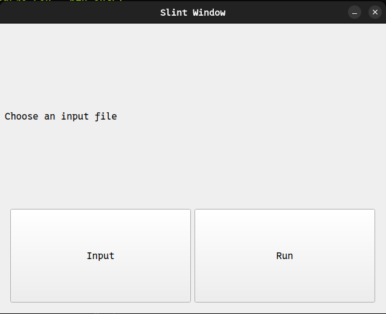

Video Frame <b style="color:Tomato;">Di</b>fference <b style="color:Tomato;">Pi</b>xel<b style="color:Tomato;">s</b> (DiPs)
===========================================================================================================================

This program is designed to find the differences in intesity of pixels in a video over time. This can be used for scientific
purposes or for anything that might require seeing how pixels in a stream change overtime.

### Current Methods
  - Overall frame difference (How much each frame is different from the first frame)
  - Per frame basis (How much each frame is different from the previous frame)
  > Per frame basis needs to be worked on and hashed out properly because as of right now it
  doesn't show anything useful

## Requirements to build:
  - Make sure you have gstreamer development files installed on your system
  - Compile through cargo

  `
    cargo build --bin entry --release
  `

## Screenshots:

